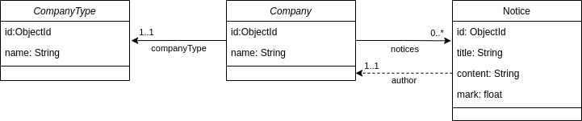
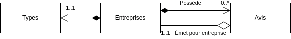

# Le ProPlusPlus
Projet cours Client-Serveur LP Web.

Fait par : 
- Corentin VÉROT
- Nicolas MORIN
- Léo GRAVIER
- Florian VIVET

### Objectif du projet 

Permettre la mise en relation d'entreprises entre elles en les regroupant 
sur une plateforme commune où elles pourront échanger des avis entre elles.

### Fonctionnalités :
- CRUD pour les entreprises (company)
- CRUD pour les notes (notice)
- Ajouter des notes aux entreprises


## Entités

Les classes correspondantes sont définies dans le package ```fr.pangolins.leProPlusPlus.domain.entities```.

### Entreprise (```Company```)
Il s'agit du document principal. Le *repository* associé correspond à l'interface 
```CompanyRepository```. 

### Type d'entreprise (```CompanyType```)
Second sous-document appartenant à une entreprise, représentant son type.

### Avis (```Notice```)
Cette entité correspond à un sous-document d'une entreprise, regroupant les avis concernant l'entreprise.
Un avis contient une référence vers l'entreprise / client ayant émit l'avis
Cette entité ne possède pas de repository dédié : 
les opérations passent via des pipelines d'agrégation.


## Services / Contrôleurs

Les classes correspondantes sont définies dans le package ```fr.pangolins.leProPlusPlus.controller```.
Vous trouverez ci-dessous les tableaux récapitulant les différentes routes disponibles

### Entreprise (```CompaniesController```)

| Url                     | Méthode | Paramètre d'URL | Corp de requête                | Description                                                                                                               |
|-------------------------|---------|-----------------|--------------------------------|---------------------------------------------------------------------------------------------------------------------------|
| /companies              | GET     |                 | Non                            | Permet de récupérer les informations de toutes les entreprises                                                            |
| /companies/{id}         | GET     | id: string      | Non                            | Permet de récupérer les informations d'une entreprises à partir de son identifiant                                        |
| /companies/name/{name}  | GET     | name: string    | Non                            | Permet de récupérer les informations d'une entreprises à partir de son nom                                                |
| /companies/search/{str} | GET     | str: string     | Non                            | Permet de lister les entreprises ayant un nom contenant la chaîne passée en paramètre                                     |
| /companies              | POST    |                 | Oui ```CreateCompanyRequest``` | Permet de créer une entreprise en indiquant les données via une ```CreateCompanyRequest```                                |
| /companies/{id}         | PUT     | id: string      | Oui ```EditCompanyRequest```   | Permet de modifier une entreprise en indiquant son identifiant et les données à modifier via une ```EditCompanyRequest``` |
| /companies/{id}         | DELETE  | id: string      | Non                            | Permet de supprimer une entreprise en indiquant son identifiant                                                           |


### Avis (```NoticesController```)

| Url                                          | Méthode | Paramètre d'URL                 | Corp de requête               | Description                                                                                                           |
|----------------------------------------------|---------|---------------------------------|-------------------------------|-----------------------------------------------------------------------------------------------------------------------|
| /companies/{companyId}/notices               | GET     | companyId: string               | Non                           | Permet de récupérer les informations de toutes les avis                                                               |
| /companies/{companyId}/notices/{id}          | GET     | companyId: string, id: string   | Non                           | Permet de récupérer les informations de toutes les avis                                                               |
| /companies/{companyId}/notices/title/{title} | GET     | companyId: string, name: string | Non                           | Permet de récupérer les informations d'une notice à partir de son titre                                               |
| /companies/{companyId}/notices               | POST    | companyId: string               | Oui ```CreateNoticeRequest``` | Permet de créer un avis en indiquant les données via une ```CreateNoticeRequest```                                    |
| /companies/{companyId}/notices/{id}          | PUT     | companyId: string, id: string   | Oui ```EditNoticeRequest```   | Permet de modifier un avis en indiquant son identifiant et les les données à modifier via une ```EditNoticeRequest``` |
| /companies/{companyId}/notices/{id}          | DELETE  | companyId: string, id: string   | Non                           | Permet de supprimer un avis en indiquant son identifiant                                                              |


### Diagrammes de conception :

#### MCD


#### UML


### Patron de conception NO-SQL

Nous avons implémenté le patron du *Schema Versioning* au sein du service ```fr.pangolins.leProPlusPlus.domain.schemaVersioning.CompanySchemaVersioning```.
